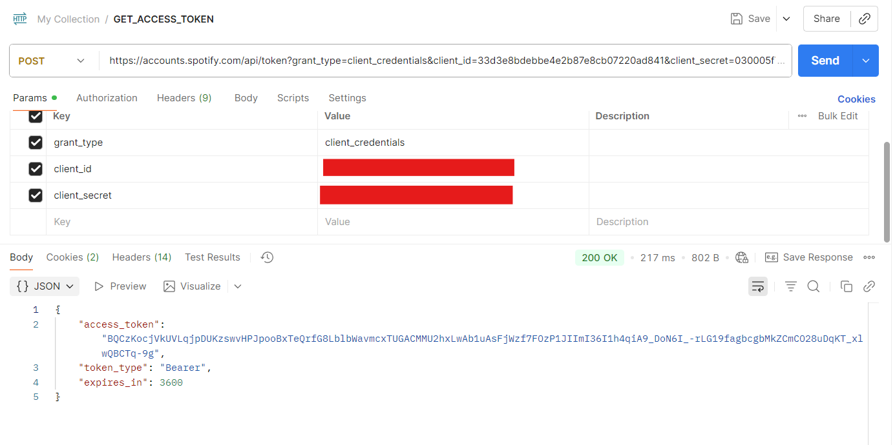
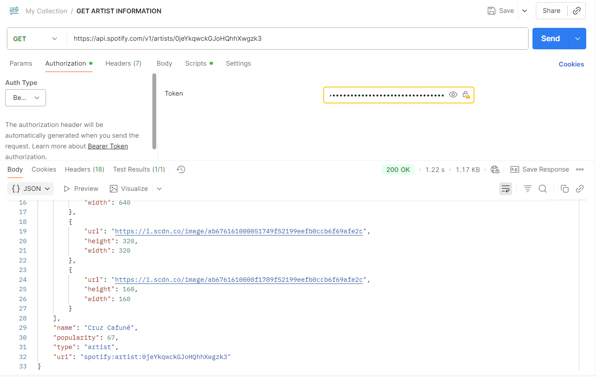
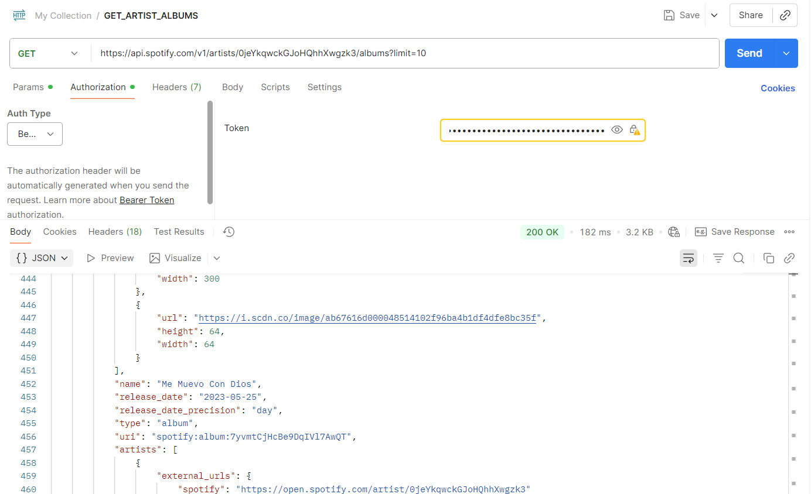
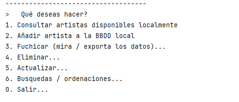

# Spotify-cli

----
## Introduccion al supuesto
Este proyecto es una aplicación desde la que poder 
tratar datos sacados de la API de Spotify para hacer búsquedas,
ordenaciones y demás. Los endpoints utilizados son:

- `/api/token`: Obtiene el **token de acceso a la API** a partir del client_id y del client_secret, que se generan en el portal de aplicaciones para desarrolladores de Spotify.

- `/artists/{id}`: A partir del ID de un artista, obtiene sus datos principales. Se utlizarán su **URL, Nombre y Oyentes mensuales**.

- `/artists/{id}/albums?limit=10`: Obtiene los 10 últimos albums de un artista por su ID. De cada album se extrae su **ID, ID del artista, Nombre y Número de tracks**.

- `/albums/{id}/`: Saca los tracks de un album. De cada track, se almacenarán su **ID, ID del album, ID del artista, Duración y Título**.

---
## Diagrama de la BBDD

---
## Manual para desarrolladores

### Puesta en marcha

- ####  Configuración

Para poner en marcha la aplicación, lo primero es definir las configuraciones en `config.properties`. Existe un fichero .example con todos los campos que debe tener.

| Parámetro                | Descripción                                                                   |
|--------------------------|-------------------------------------------------------------------------------|
| `database.url`           | URL de conexión a la base de datos MySQL (en el puerto 3307 usando docker)    |
| `database.user`          | Usuario de la base de datos (root usando docker)                              |
| `database.password`      | Contraseña de acceso a la base de datos (`renaido` por defecto usando docker) |
| `database.delete.tables` | **Peligroso**: Elimina todas las tablas existentes al iniciar                 |
| `database.init.tables`   | Crea las tablas automáticamente si no existen                                 |
| `database.init.data`     | Inserta datos iniciales/predefinidos en las tablas                            |
| `storage.data`           | Ruta del directorio para almacenar archivos de datos                          |
| `client.id`              | ID de la aplicación de Spotify                                                |
| `client.secret`          | Clave secreta de la aplicación de Spotify                                     |

- #### Base de datos

Este programa necesita internet lógicamente para conectarse con la api de Spotify, pero podemos hacer un manejo offline una vez cargados los datos a la BBDD. 
Para usar el programa es necesario tener inizializado el contenedor de docker de la BBDD con `docker-compose up -d`.

### Paquetes y clases:

- **api**: Se encarga, con la clase `ApiClient` de hacer las peticiones HTTP y desserializar los datos obtenidos en JSON. Al inicializar la clase, se ejecuta siempre el método `getApiToken()`, que obtiene a partir del client_id y client_secret un token temporal para poder usar la API.
- **config**: Con la clase `Config` Deserializa el fichero `config.properties`. En este se definen configuraciones tales como el URL de la base de datos.
- **database**: La clase `DatabaseService` simplifica las conexiones SQL para no tener que usar `PreparedStatement` en los repository.
- **models**: Almacena los modelos de objetos relativos a las tablas de la BBDD. 
- **repository**: Relaciona el acceso a la BBDD con el acceso a la API para cada objeto.
- **storage**: Con la clase `CsvExporter` se pueden exportar listas de todos los modelos de dato.
- **view**: Este paquete se encarga de mostrar en pantalla los menús con la clase `Menu` y de formatear listas de tipos de datos con `Formatters`.

---
## Manual de usuario
Para usar la aplicación, debes tener definidas **las configuraciones que se mencionaron anteriormente en `config.properties` y la base de datos inizializada en docker**. 
Una vez inicializada, tendrás las opciones para seleccionar mediante números.

- **Consultar artistas disponibles localmente**: Devuelve un listado con los artistas almacenados en local.
- **Añadir artista a la BBDD local**: Al meter un ID de un artista, añade sus 10 primeros albums con sus tracks a la BBDD local para poder consultarlos.
- **Fuchicar (mira / exporta los datos)...**: Esta función es una especie de explorador. Si seleccionas un artista, ves sus albums, y al seleccionar un album, puedes ver sus tracks. Siempre te da la opción tanto de exportar los datos como de solamente visualizarlos.
- **Eliminar...**: Permite eliminar cualquier tipo de dato.
- **Actualizar...**: Permite actualizar cualquier tipo de dato con interfaz.
- **Busquedas / ordenaciones...**: Hace búsquedas y ordenaciones predefinidas en la BBDD, dando la opcion de exportar a CSV siempre que se quiera.

---
## Reparto de tareas
Hice yo todo xd.

---
## Propuestas de mejora
 - [ ] Función de **exportación y importación** de todos los datos juntos para permitir migraciones.
 - [ ] **Cruzar datos** a la hora de exportar para que en vez de, por ejemplo, `artist_id` aparezca el nombre del artista.
 - [ ] Integración de otras API de música, como **Soundcloud o Tidal** para poder cruzar los datos.
 - [ ] Posibilidad de **sacar estadísticas / hacer más búsquedas**.
 - [ ] Manejo de los errores, para que el programa no pueda crashear y solo muestre mensajes de error con `try-catch`.

---
## Conclusión
Honestamente, odio que flipas programar y me metí a este ciclo por no meterme en ASIR y no aprender nada. 

Al llegar a este instituto, no entendía nada de la manera de organizar los paquetes y clases que se usaban en el IES Teis y me desmotivó bastante, pero al hacer el examen y este proyecto reconozco haber aprendido un montón de cosas y perfeccionado habilidades que antes no tenía, por lo que aunque no me guste, merece la pena solo por el resultado de saber programar y estructurar, que en el campo de la informática es muy valorado y útil.